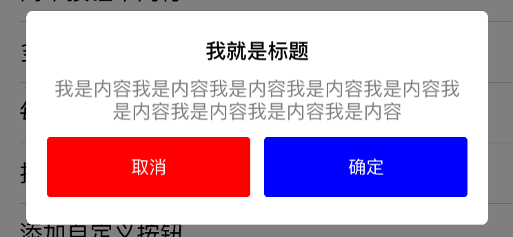

# ZGAlertView

* 一个替代`UIAlertView`的弹出提示框实现
* 可以自定义标题、内容的字体大小和颜色
* 可以自定义**操作按钮**的数量，及每一行显示的按钮数
* 可以自定义**取消按钮**的位置
* 可以添加自定义样式的**操作按钮**到指定的位置
* 支持`delegate`和`block`响应按钮的点击事件

##显示一个弹出框

	alertView = [[ZGAlertView alloc] initWithTitle:@"我就是标题"
                                                   message:@"我是内容我是内容我是内容我是内容我是内容我是内容我是内容我是内容我是内容"
                                         cancelButtonTitle:@"取消"
                                         otherButtonTitles:@"确定", nil];
    [alertView show];
            
