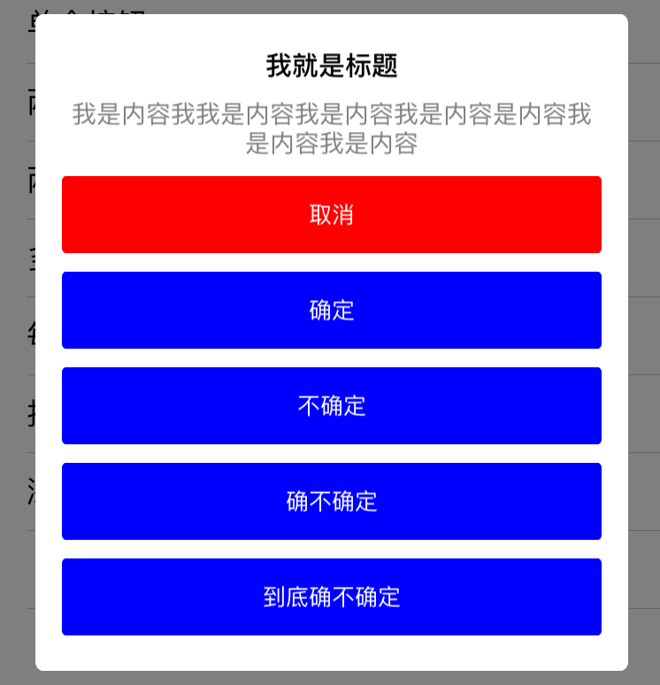
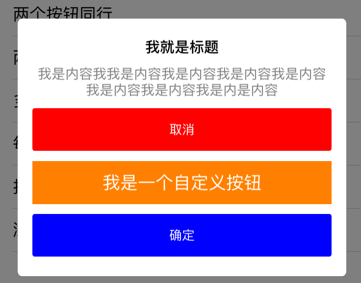
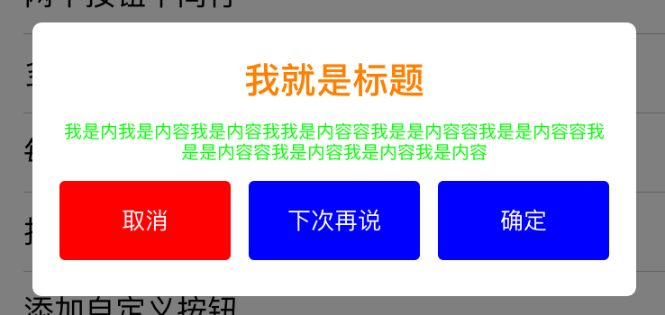

# ZGAlertView

* 一个替代`UIAlertView`的弹出提示框实现
* 可以自定义标题、内容的字体大小和颜色
* 可以自定义 **操作按钮** 的数量，及每一行显示的按钮数
* 可以自定义 **取消按钮** 的位置
* 可以添加自定义样式的 **操作按钮** 到指定的位置
* 支持`delegate`和`block`响应按钮的点击事件
* 支持`IOS6`及以上系统版

##如何使用

###显示一个弹出框

	alertView = [[ZGAlertView alloc] initWithTitle:@"我就是标题"
                                           message:@"我是内容我是内容我是内容我是内容我是内容我是内容我是内容我是内容我是内容"
                                 cancelButtonTitle:@"取消"
                                 otherButtonTitles:@"确定", nil];
                                 
    alertView.dismissBlock = ^(NSInteger buttonIndex) {//设置点击按钮时的回调
        NSLog(@"block response click at index %ld",(long)buttonIndex);
    };
    
    [alertView show];
            

###添加多个操作按钮

	alertView = [[ZGAlertView alloc] initWithTitle:@"我就是标题"
                                           message:@"我是我是内容我是内容我是内容内容我是内容我是内容我是内容"
                                 cancelButtonTitle:@"取消"
                                 otherButtonTitles:@"确定",@"不确定",@"确不确定",@"到底确不确定", nil];
    alertView.cancelButtonIndex = 3;//修改取消按钮位置
    [alertView show];

###添加自定义按钮
	alertView = [[ZGAlertView alloc] initWithTitle:@"我就是标题"
                                           message:@"我是内容我我是内容我是内容我是内容我是内容我是内容我是内容我是内是内容"
                                 cancelButtonTitle:@"取消"
                                 otherButtonTitles:@"确定", nil];
            
    UIButton *customButton = [UIButton buttonWithType:UIButtonTypeCustom];
    customButton.backgroundColor = [UIColor orangeColor];
    [customButton setTitle:@"我是一个自定义按钮" forState:UIControlStateNormal];
    [alertView addCustomButton:customButton toIndex:1];//添加自定义按钮到指定位置
            
    [alertView show];

###修改标题和内容字体大小和颜色

	alertView = [[ZGAlertView alloc] initWithTitle:@"我就是标题"
                                           message:@"我是内我是内容我是内容我我是内容容我是是内容容我是是内容容我是是内容容我是内容我是内容我是内容"
                                 cancelButtonTitle:@"取消"
                                 otherButtonTitles:@"下次再说",@"确定", nil];
    alertView.rowMaxButtonNumber = 3;//设置同一行最多显示的按钮数
    alertView.titleFont = [UIFont boldSystemFontOfSize:20];//标题字体大小
    alertView.titleColor = [UIColor orangeColor];//标题字体颜色
    alertView.messageFont = [UIFont systemFontOfSize:10];//内容字体大小
    alertView.messageColor = [UIColor greenColor];//内容字体颜色
    
    [alertView show];

##如何引用

下载示例工程后，将`Lib`文件夹加入自己的工程，在需要使用的类中`#import "ZGAlertView.h" `即可。

##计划功能

* 添加编辑框功能
* 添加弹框出现和消失动画，预设几种常用动画，同时提供自定义动画接口